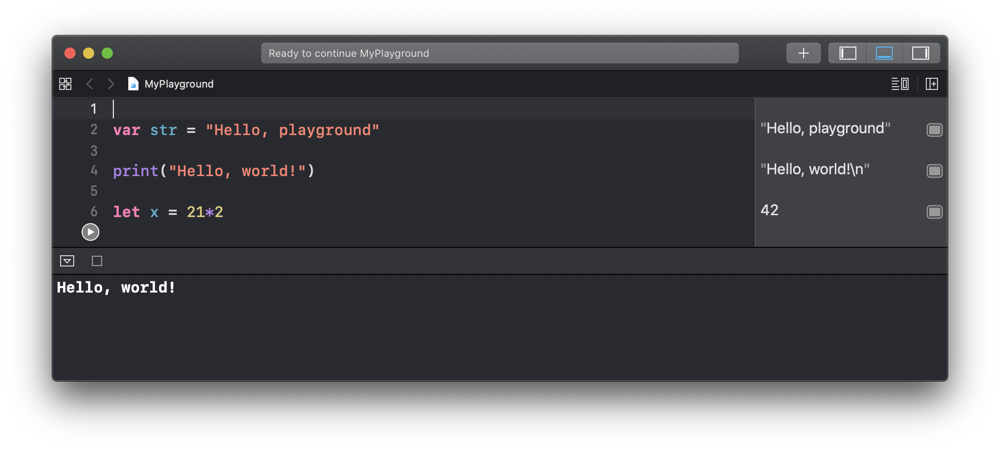
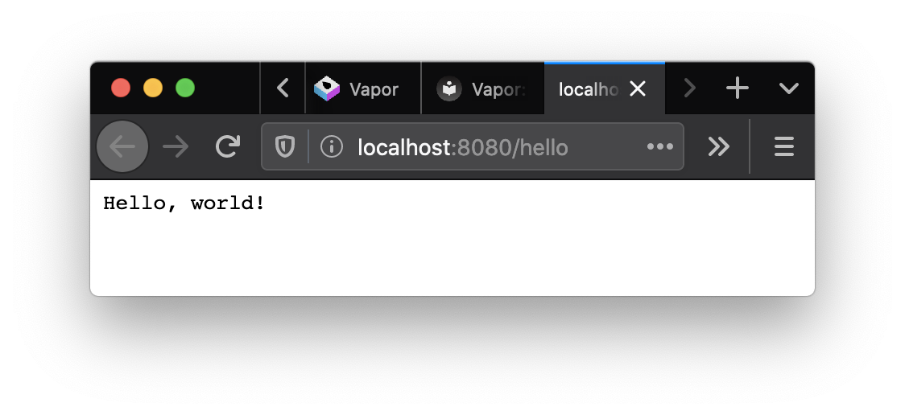

# Swift

## What is Swift?

Find out here: [swift.org](https://swift.org/)

**Swift** is a general-purpose programming *language* built using a modern approach to safety, performance, and software design patterns. The goal of the **Swift project** is to create the best available *language* for uses ranging from systems programming, to mobile and desktop apps, scaling up to cloud services.

[Swift evolution](https://apple.github.io/swift-evolution/)

Latest Swift news: [swift.org/blog](https://swift.org/blog/)


## What is it good for?

It's general purpose. Do anything you want, on any platform you want.

First class support (as of mid 2020) for:

* Ubuntu, CentOS, Amazon Linux
* macOS
* i(Pad)OS
* watchOS
* tvOS

Windows support is coming in a near-future milestone.

It can run on a Raspberry Pi, [demo here](https://lickability.com/blog/swift-on-raspberry-pi/)


## What's it like?

It is safe, fast, and IMO elegant and civilized (especially compared with ObjC)

Supports a REPL (read-eval-print loop) like Lisp, Ruby or Python:

```swift
% swift
1> print("Hello, world!")
Hello, world!
2> let x = 21*2
x: Int = 42
```



## Vapor: run server-side Swift in a web framework

% brew install vapor/tap/vapor

[Create](https://docs.vapor.codes/4.0/hello-world/) a Vapor project

```swift
import Vapor
 
let app = try Application(.detect())
defer { app.shutdown() }

app.get("hello") { req in
    return "Hello, world."
}

try app.run()
```



## Lambda: run a Swift microservice
Package Swift code to run as an AWS Lambda 

```swift
import AWSLambdaRuntime

// Request, uses Codable for transparent JSON encoding
private struct Request: Codable {
  let name: String
}

// Response, uses Codable for transparent JSON encoding
private struct Response: Codable {
  let message: String
}

// In this example we are receiving and responding with `Codable`.
Lambda.run { (context, 
				request: Request, 
				callback: @escaping (Result<Response, Error>) -> Void) in
  callback(.success(Response(message: "Hello, \(request.name)")))
}
```

## TensorFlow: interoperate with Python for ML

[TensorFlow using Python from Swift](https://www.tensorflow.org/swift/tutorials/python_interoperability)

[Why?](https://github.com/tensorflow/swift/blob/master/docs/WhySwiftForTensorFlow.md)

Current Python challenges:

* Performance
* Concurrency
* Deployment (compiles to native code, no garbage collector)
* Custom Ops: GPU kernels for NVidia and AMD

```swift
import Python

let numpy = Python.import("numpy")
let zeros = numpy.ones([2, 4])
/* [[1, 1, 1, 1]
    [1, 1, 1, 1]] */
```
## Swift in Jupyter Notebook

[Google's swift-jupyter project](https://github.com/google/swift-jupyter)


## Where do I go to learn it?

* Swift Getting Started at [swift.org](https://docs.swift.org/swift-book/LanguageGuide/TheBasics.html)

* [100 Days of Swift](https://www.hackingwithswift.com/100) by Paul Hudson
* [Ray Wenderlich tutorials](https://www.raywenderlich.com/ios/paths/learn) at raywenderlich.com
* [Apple WWDC videos](https://developer.apple.com/videos/) at developer.apple.com

